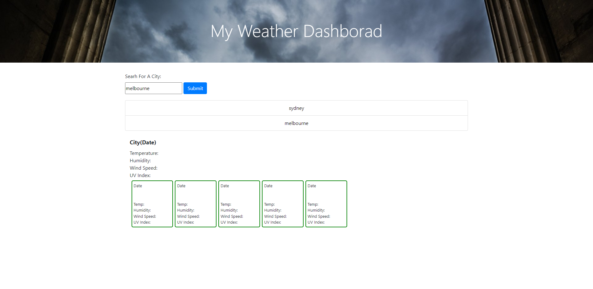

## My Weather Dashboard ##

# Description #
For our week 6 challenge we are asked to make a 5 day weather dashboard that includes the following:
* Current weather forecast that includes Temperature, Humidity, Wind Speed, and UV Index.
* Local Storage function to display recent searches.
* Weather Icons. 
* Date.

For this challenge i tried to incorporate google Autocomplete API that i had used in a group project challenge, yet i was unsuccsesful.
I also could not get any of the open weather API data to display on my webpage, i encountered a CORS error in console and could not figure out how to fix this.
Im not to sure if this error had somthing to do with AJAX witch i was trying to use.

# Acceptance Criteria #
* GIVEN a weather dashboard with form inputs
* WHEN I search for a city
* THEN I am presented with current and future conditions for that city and that city is added to the search history
* WHEN I view current weather conditions for that city
* THEN I am presented with the city name, the date, an icon representation of weather conditions, the temperature, the humidity, the wind speed, and the UV index
* WHEN I view the UV index
* THEN I am presented with a color that indicates whether the conditions are favorable, moderate, or severe
* WHEN I view future weather conditions for that city
* THEN I am presented with a 5-day forecast that displays the date, an icon representation of weather conditions, the temperature, the wind speed, and the humidity
* WHEN I click on a city in the search history
* THEN I am again presented with current and future conditions for that city

# Live URL
 https://zac0088.github.io/My-Weather-Forcaster/

# Screenshots

.png)
# Contact Page
https://github.com/Zac0088/My-Weather-Forcaster
